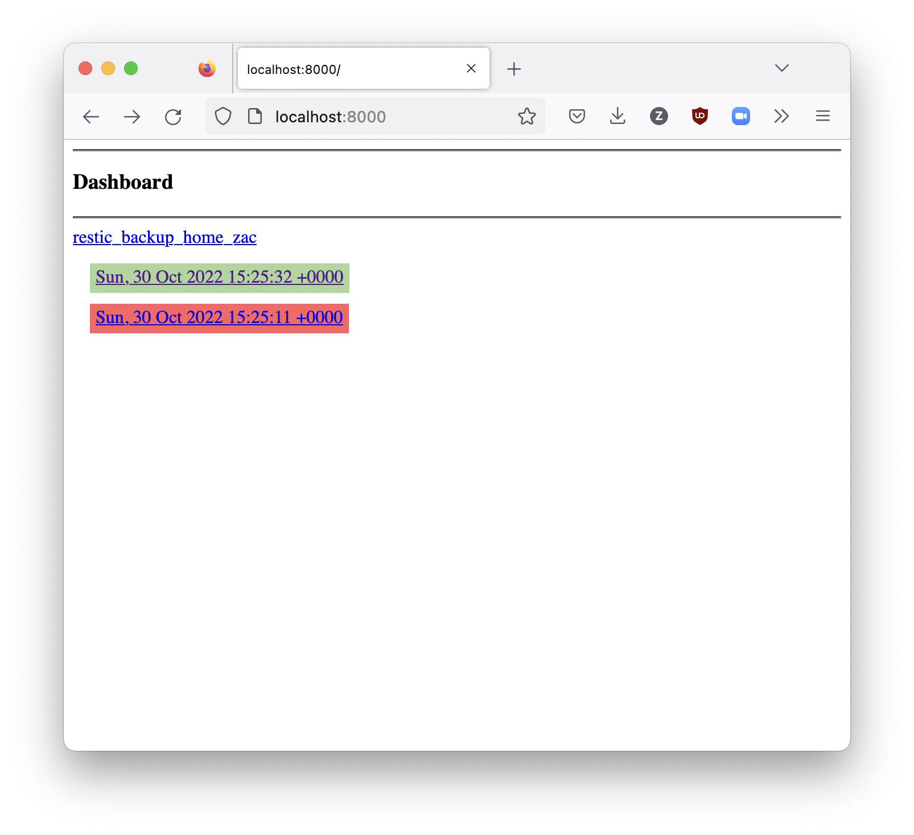
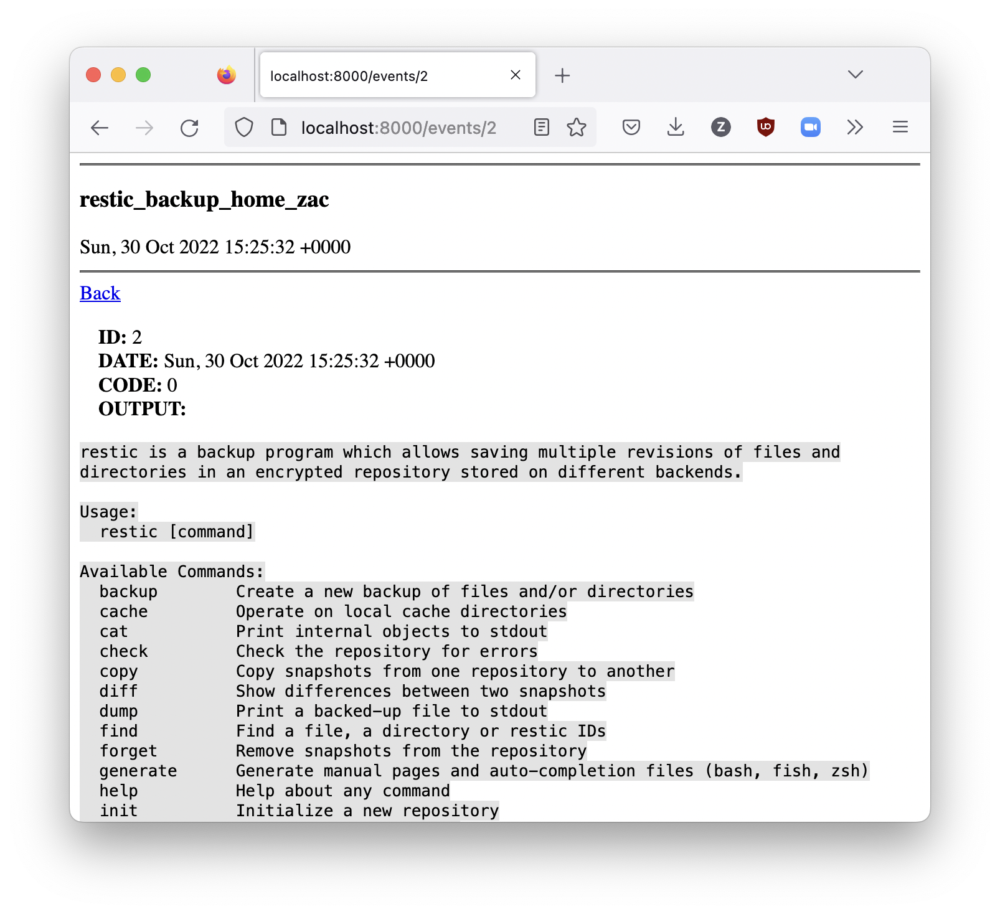

# Cronic

Cronic is a simple tool for saving and observing events on a remote server.

For example, if you have a cron job that runs periodically you can use a simple curl at the end of the job to capture the output.
It will be written to disk for later viewing. 
This can be helpful when running cron jobs whose output is critical (e.g. backups).

## Design

A REST server with a SQLite db that will record `events` which contain a `source` (string), `output` (string) and an error `code` (int).

An event's `source` is a unique identifier, `restic_backup_bookstack` for example.

A dashboard is presented on `0.0.0.0:8000` that shows basic information for the most recent events by source.

## Usage

This is an example `curl` request for saving a new event.

```
curl -X POST -d 'source=restic_backup_bookstack' -d 'output=successful backup!' -d 'code=0' http://localhost:8000/events/new
```

## Screenshots




